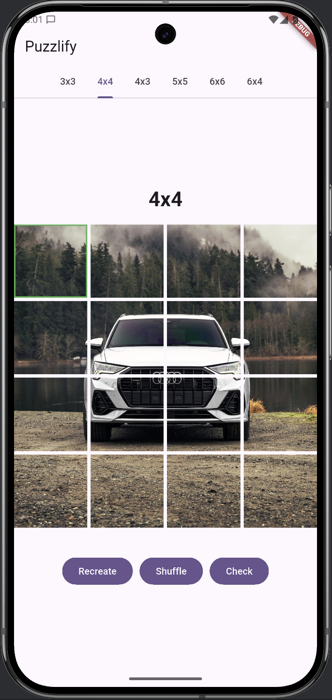
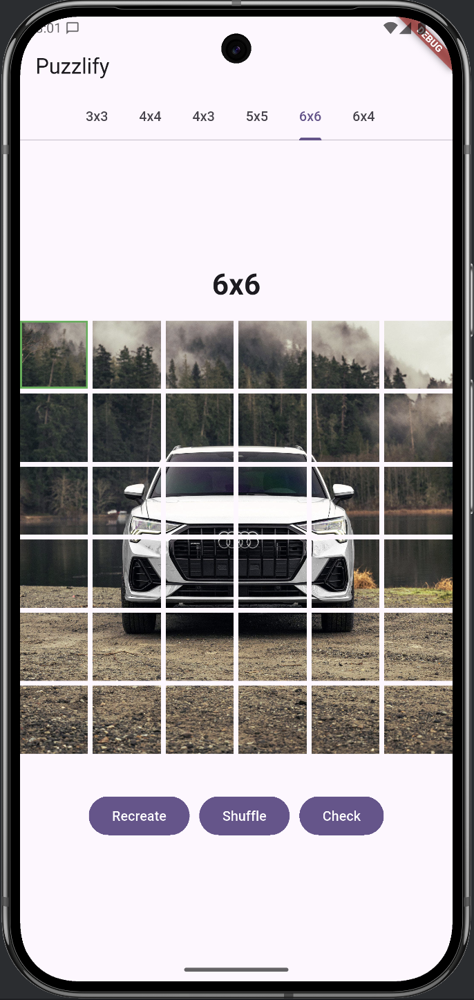

# Puzzlify 🧩

A Flutter widget that turns any image into an interactive **puzzle game**.  
Supports splitting an image into custom grid sizes, shuffling, recreating, and checking solved state.

---
## 🎬 Demo

Here is how **Puzzlify** looks in action:

  


## ✨ Features
- Load image from **local file** or **network**
- Split into custom rows × columns
- Show puzzle pieces as grid
- **Controller** for shuffle, recreate, and check
- Shimmer loading state while processing image
- Fully customizable borders & spacing

---

## 📦 Installation

Add `puzzlify` to your `pubspec.yaml`:

```yaml
dependencies:
  puzzlify: ^0.0.1
```

Then run:

```bash
flutter pub get
```

---

## 🚀 Usage

### Local image
```dart
import 'dart:io';
import 'package:puzzlify/puzzlify.dart';

final controller = PuzzlifyController();

Puzzlify.local(
  size: SizeModel(4, 4),          // rows × columns
  bytes: File("assets/car.jpg").readAsBytesSync(),
  controller: controller,
);
```

### Network image
```dart
import 'package:puzzlify/puzzlify.dart';
import 'package:http/http.dart' as http;

Future<Widget> buildPuzzle() async {
  final response = await http.get(Uri.parse("https://picsum.photos/600"));
  return Puzzlify.local(
    size: SizeModel(3, 3),
    bytes: response.bodyBytes,
    controller: PuzzlifyController(),
  );
}
```

---

## 🎮 Controller

The `PuzzlifyController` allows you to **control the puzzle** programmatically:

```dart
final controller = PuzzlifyController();

Puzzlify.local(
  size: SizeModel(4, 4),
  bytes: myBytes,
  controller: controller,
);

ElevatedButton(
  onPressed: () => controller.derange(),   // shuffle pieces
  child: Text("Shuffle"),
);

ElevatedButton(
  onPressed: () => controller.recreate(),  // reset puzzle
  child: Text("Recreate"),
);

ElevatedButton(
  onPressed: () {
    final solved = controller.check();     // check solved
    print("Solved: $solved");
  },
  child: Text("Check"),
);
```

---

## 📑 Example with Tabs

You can create multiple puzzle sizes in tabs:

```dart
class PuzzleTabsPage extends StatelessWidget {
  @override
  Widget build(BuildContext context) {
    return DefaultTabController(
      length: 5,
      child: Scaffold(
        appBar: AppBar(
          title: Text("Puzzlify"),
          bottom: TabBar(
            isScrollable: true,
            tabs: [
              Tab(text: "3x3"),
              Tab(text: "4x4"),
              Tab(text: "4x3"),
              Tab(text: "5x5"),
              Tab(text: "6x6"),
              Tab(text: "6x4"),
            ],
          ),
        ),
        body: TabBarView(
          children: [
            PuzzlePageCustom(row: 3, col: 3),
            PuzzlePageCustom(row: 4, col: 4),
            PuzzlePageCustom(row: 4, col: 3),
            PuzzlePageCustom(row: 5, col: 5),
            PuzzlePageCustom(row: 6, col: 6),
            PuzzlePageCustom(row: 6, col: 4),
          ],
        ),
      ),
    );
  }
}
```

---

## ⚙️ Configuration

You can customize borders, spacing, and selection styles using `PuzzlifyConfig`.

```dart
PuzzlifyConfig(
  borderRadius: BorderRadius.circular(10),
  borderSelectColor: Colors.green,
  borderSelectWidth: 2,
  horizontalSpace: 5,
verticalSpace: 5,
);
```

---

## 📸 Screenshot (Example)

(You can add a screenshot or gif here later)

---

## 📄 License

MIT License © 2025
